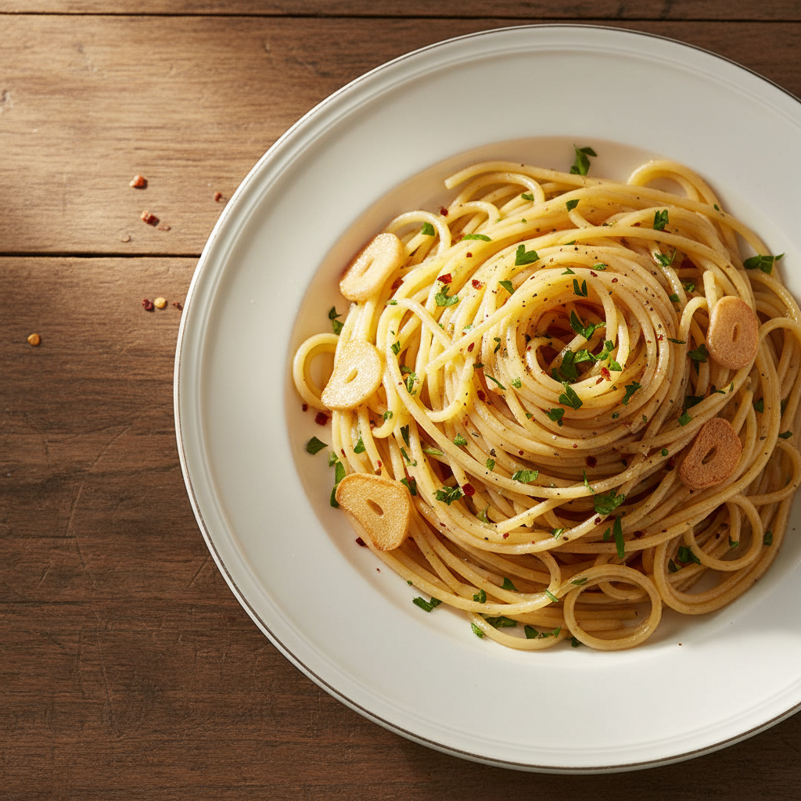

# 알리오올리오 (Aglio e Olio)

> ⏱️ 조리시간: 15분 | 🍽️ 1인분 | 난이도: ⭐ 쉬움

## 📝 재료
- 스파게티 면 — 100g
- 마늘 — 4~5쪽
- 올리브유 — 3~4큰술
- 소금 — 약간 (면 삶는 물용)
- 후추 — 약간
- 페페론치노(건고추) — 1~2개 *(없으면 생략 가능)*
- 파슬리 — 약간 *(없으면 생략 가능)*

## 👨‍🍳 만드는 법

1. **물 끓이기** — 냄비에 물을 넉넉히 붓고 강불로 끓입니다. 물이 끓으면 소금을 한 큰술 넣어주세요. (이 사이에 마늘을 준비하면 시간이 절약돼요!)
2. **마늘 준비** — 마늘을 얇게 슬라이스합니다. 칼 옆면으로 마늘을 눌러 으깬 뒤 썰면 더 쉬워요.
3. **면 삶기** — 끓는 물에 스파게티를 넣고 봉지 표기 시간보다 1분 일찍 건져낼 준비를 하세요. (면수 한 국자는 꼭 남겨두세요!)
4. **마늘 볶기** — 면을 삶는 동안 프라이팬에 올리브유를 두르고 약불로 마늘을 넣습니다. 마늘이 노릇하게 될 때까지 천천히 볶아주세요. 타지 않도록 주의하세요! 페페론치노가 있다면 함께 넣어주세요.
5. **면과 소스 합치기** — 삶은 면을 프라이팬에 옮기고, 남겨둔 면수를 조금씩 넣으면서 잘 섞어주세요. 면수의 녹말이 소스를 걸쭉하고 매끄럽게 만들어줘요.
6. **마무리** — 후추를 뿌리고, 파슬리가 있다면 위에 올려 완성합니다. 그릇에 담아 바로 드세요!

## 💡 꿀팁
- **면수는 필수!** 면을 건질 때 면수 한 국자(약 100ml)를 꼭 남겨두세요. 소스가 너무 뻑뻑하면 면수를 조금씩 넣어 농도를 조절할 수 있어요.
- **마늘은 약불로 천천히** — 강불에서 볶으면 금방 타버려요. 약불에서 은은하게 향을 내는 게 핵심이에요.
- **설거지 최소화 팁** — 면을 삶은 냄비에 바로 소스를 섞어도 돼요. 프라이팬 대신 냄비 하나로 완성하면 설거지가 확 줄어요!
- **재료 대체** — 올리브유가 없으면 식용유로도 만들 수 있어요. 페페론치노 대신 고추장을 살짝 넣으면 한국식 알리오올리오가 완성돼요.
- **면 종류** — 스파게티가 없으면 소면이나 다른 파스타 면으로도 OK예요!
