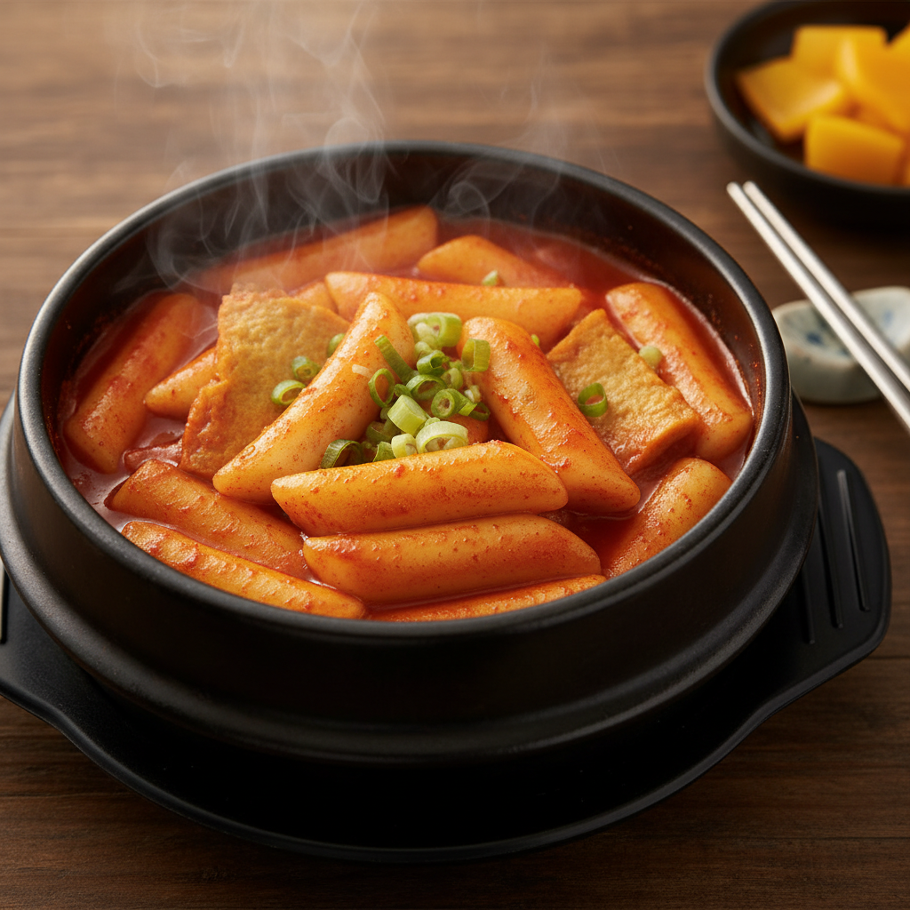

# 떡볶이

> 조리시간: 15분 | 1인분 | 난이도: 쉬움

## 재료
- 떡볶이 떡 — 200g
- 어묵 — 1장 (없으면 생략 가능)
- 물 — 1컵 (200ml)
- 고추장 — 1.5 큰술
- 간장 — 1 작은술
- 설탕 — 1 큰술
- 대파 — 약간 (없으면 생략 가능)

## 만드는 법
1. 떡볶이 떡이 딱딱하다면 찬물에 5분간 담가 부드럽게 만들어 주세요.
2. 어묵은 먹기 좋은 크기로 잘라 주세요.
3. 냄비에 물 1컵을 붓고 고추장, 간장, 설탕을 넣고 잘 섞어 주세요.
4. 중불로 켜고 소스가 끓기 시작하면 떡과 어묵을 넣어 주세요.
5. 중약불로 줄이고 떡이 부드러워질 때까지 7~8분간 저어가며 졸여 주세요.
6. 소스가 걸쭉해지고 떡이 말랑해지면 완성이에요! 대파를 올려 내어 주세요.

## 꿀팁
- 냄비 하나만 사용하면 설거지가 최소화돼요. 소스 재료를 냄비에 바로 넣고 섞으세요.
- 떡이 냄비 바닥에 눌어붙지 않도록 중간중간 꼭 저어 주세요.
- 고추장 양을 줄이면 덜 맵게, 늘리면 더 맵게 조절할 수 있어요.
- 어묵 대신 삶은 달걀, 햄, 또는 두부를 넣어도 맛있어요.
- 남은 소스에 밥을 비벼 먹으면 꿀맛이에요!
