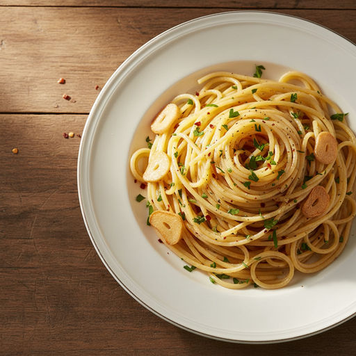
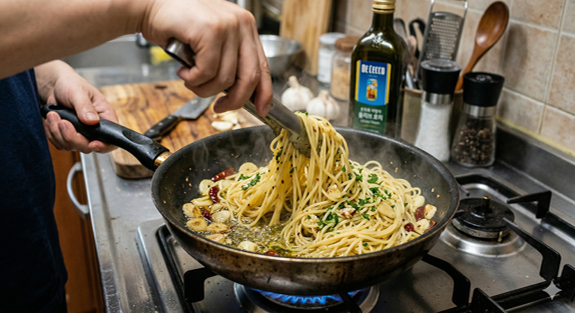

# 매콤 알리오올리오 (Spicy Aglio e Olio)

> *"불의 온도를 다스리는 자만이 마늘의 진정한 향을 끌어낼 수 있다."*

나폴리 빈민가의 셰프들이 마늘과 올리브유, 그리고 건고추만으로 창조해낸 이 파스타는 '가난의 미학'이라 불린다. 약불 위에서 천천히 황금빛으로 익어가는 마늘 슬라이스, 그 위로 페페론치노의 매운 향이 피어오르는 순간이야말로 이 요리의 절정이다. 여기에 한국의 고추기름과 청양고추가 더해져, 동서양의 매운맛이 하나의 접시 위에서 조우하는 특별한 한 끼가 탄생한다.

---

**조리 시간** 15분 · **서빙** 1인분 · **난이도** Easy

---

## Ingredients

| | |
|:------|:------|
| 스파게티 면 — 100g | 마늘 — 4~5쪽 |
| 올리브유 — 3~4큰술 | 소금 — 약간 (면 삶는 물용) |
| 후추 — 약간 | 페페론치노(건고추) — 2~3개 |
| 고추기름 — 1큰술 *(고춧가루 1작은술로 대체 가능)* | 청양고추 — 1개 *(생략 가능)* |
| 파슬리 — 약간 *(생략 가능)* | |

---

## Method

| Classic | Light |
|:------|:------|
| **01** 냄비에 물 넉넉히 붓고 강불로 가열. 끓으면 소금 1큰술 투입. | **01** 동일. 소금은 1/2큰술로 줄여 나트륨 조절. |
| **02** 마늘 얇게 슬라이스. 칼 옆면으로 으깬 뒤 썰면 수월함. | **02** 동일. 마늘은 열량 거의 없으므로 넉넉히 사용. |
| **03** 면은 포장 표기보다 1분 일찍 건져 알덴테 식감 확보. 면수 한 국자 반드시 보관. | **03** 스파게티 대신 곤약면 또는 통밀면(80g)으로 대체하면 열량 대폭 감소. |
| **04** 팬에 올리브유 + 고추기름 두르고 약불에서 마늘·페페론치노·청양고추 천천히 볶기. 매운 향 올라오면 적절한 시점. | **04** 올리브유 1작은술만 사용, 고추기름 제외. 논스틱 팬 활용. |
| **05** 삶은 면 팬으로 옮기고 면수 조금씩 더하며 소스와 고루 섞기. | **05** 동일. 면수 넉넉히 활용해 기름 부족분 보완. |
| **06** 후추 갈아 올리고 파슬리 뿌려 마무리. | **06** 후추와 파슬리로 마무리. |

---

## Chef's Note

| Classic Tips | Light Tips |
|:------|:------|
| 면수가 소스의 핵심 — 약 100ml 확보해둘 것. 에멀전 형성의 관건. | 곤약면은 면수 없으므로 물 100ml + 소금 약간으로 대용. |
| 마늘은 반드시 약불 — 강불이면 순식간에 타서 쓴맛 발생. | 올리브유 1작은술 + 논스틱 팬이면 충분. |
| 냄비 하나로 면 삶고 그대로 소스 완성하면 설거지 최소화. | 동일. 냄비 일원화 추천. |
| 매운맛 조절 — 페페론치노 부숴서 씨까지 넣으면 더 강렬. | 고추기름 빼고 고춧가루만 써도 매운맛 유지되며 열량 절감. |
| 올리브유 없으면 식용유로 대체 가능. | 통밀면·곤약면으로 바꾸면 열량 50% 이상 절감. |
| 소면이나 다른 파스타 면으로도 응용 가능. | 애호박 줄리엔느 커팅하면 초저열량 버전 완성. |

---

## Nutrition Facts (1인분 기준)

| | Classic | Light |
|:------|:------:|:------:|
| **칼로리** | 520 kcal | 280 kcal |
| **단백질** | 12 g | 8 g |
| **탄수화물** | 68 g | 35 g |
| **지방** | 22 g | 8 g |

*영양 정보는 추정치이며, 재료 브랜드·계량에 따라 달라질 수 있습니다.*

---

## Cost Estimate (1인분 기준)

| | 예상 비용 |
|:------|:------:|
| **Classic** | 약 3,500원 |
| **Light** | 약 4,000원 |

*기본 양념(간장, 설탕, 고추장, 식용유, 소금, 후추) 비용은 제외. 대형마트 기준 추정가입니다.*

---

> **Sommelier's Pairing** · 드라이 화이트 와인(피노 그리지오) 또는 시원한 탄산수 — 매운 열기를 정제하고 마늘의 여운을 산뜻하게 마무리한다.

---

*Recipe curated by Quick Cuisine Director — where simplicity meets elegance.*
