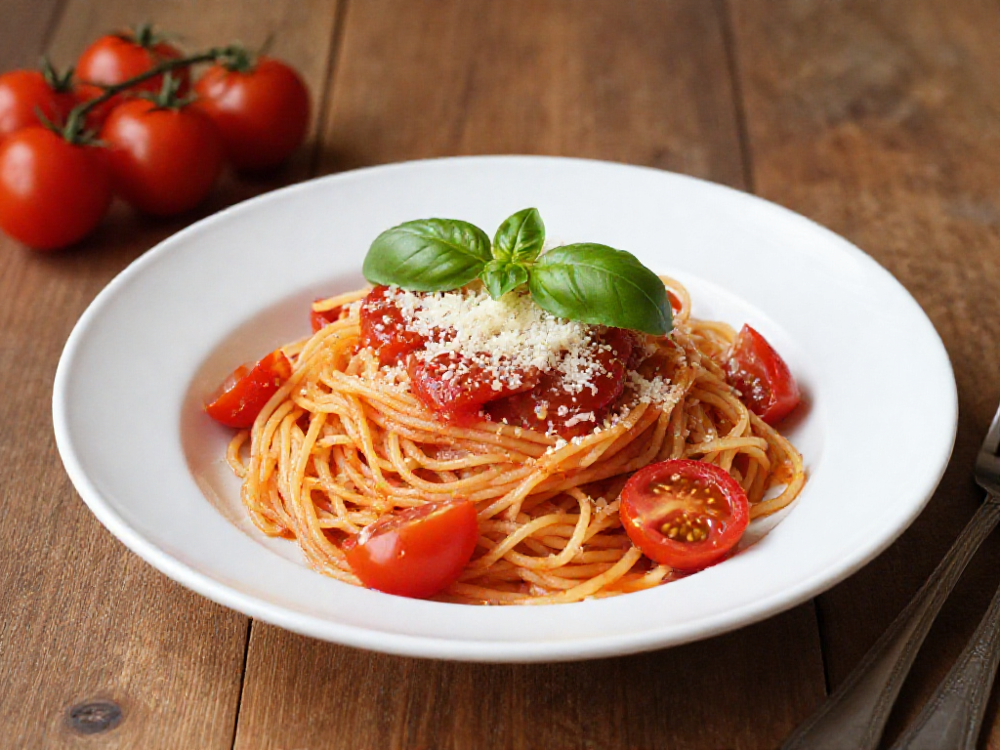

# 토마토 파스타

> 15분 안에 완성되는 간단하고 맛있는 토마토 파스타

- 소요시간: 15분
- 인분: 2인분

---

## 재료

- 스파게티 면 160g
- 토마토 (큰 것) 2개 또는 방울토마토 15~20개
- 마늘 4쪽 (얇게 슬라이스)
- 올리브오일 3큰술
- 소금 1작은술 (면 삶는 물용) + 간 맞출 소금 약간
- 후추 약간
- 설탕 1/2작은술 (산미 조절용)
- 바질 또는 파슬리 약간 (선택)
- 파마산 치즈 약간 (선택)

---

## 만드는 법

1. 냄비에 물을 넉넉히 붓고 소금을 넣어 끓이기 시작합니다. 물 끓이는 동안 아래 재료를 준비하세요.
2. 토마토를 굵게 다지거나, 방울토마토는 반으로 썹니다. 마늘은 얇게 슬라이스합니다.
3. 물이 끓으면 스파게티 면을 넣고 봉투에 적힌 시간보다 1분 덜 삶습니다. 삶는 물 1/2컵을 꼭 따로 챙겨두세요.
4. 면 삶는 동안 팬에 올리브오일을 두르고 중불에서 마늘을 30초~1분 볶아 향을 냅니다 (타지 않게 주의).
5. 토마토를 팬에 넣고 2~3분간 볶으며 으깨줍니다. 소금, 후추, 설탕으로 간을 맞춥니다.
6. 삶은 면을 팬에 넣고, 파스타 삶은 물을 조금씩 추가하며 30초~1분간 함께 볶아 소스가 면에 잘 배도록 합니다.
7. 불을 끄고 바질이나 파슬리, 파마산 치즈를 올려 마무리합니다.

---

## 팁

- **파스타 삶은 물(전분물)** 은 소스의 농도를 조절하고 면에 소스가 잘 붙게 해주는 핵심 재료입니다. 절대 버리지 마세요!
- 토마토 대신 **캔 토마토(홀/다이스드) 1/2캔** 을 사용하면 더 진하고 풍부한 맛이 납니다.
- 매운 것을 좋아하면 마늘 볶을 때 **페페론치노(또는 청양고추)** 를 함께 넣어보세요.
