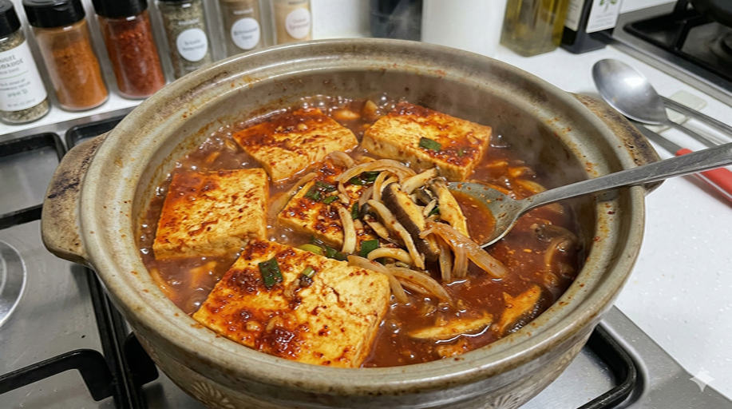

# 저칼로리 매콤단짠 두부조림

> ⏱️ 조리시간: 15분 | 🍽️ 1인분 | 난이도: ⭐ 쉬움 | 🔥 약 150kcal

## 📝 재료
| | |
|------|------|
| 두부 (부침용) — 1/2모 (약 150g) | 대파 — 1/4대 |
| 물 스프레이 또는 식용유 — 1작은술 | 간장 — 2큰술 |
| 고추장 — 1/2큰술 | 알룰로스(또는 스테비아) — 1큰술 |
| 다진 마늘 — 1작은술 (없으면 마늘가루 1/2작은술) | 고춧가루 — 1작은술 (매운맛 조절 가능) |
| 물 — 4큰술 | |

## 👨‍🍳 만드는 법

| 🍽️ 맛있게 만드는 법 | 🥗 저칼로리로 만드는 법 |
|------|------|
| 1. 두부를 1.5cm 두께로 썰고 키친타월로 물기 제거. | 1. 동일. 물기 제거는 바삭함의 핵심! |
| 2. 양념장: 간장 2큰술, 고추장 1큰술, 설탕 1큰술, 다진 마늘, 참기름, 고춧가루, 물 섞기. | 2. 양념장: 간장 2큰술, 고추장 1/2큰술, 알룰로스 1큰술, 다진 마늘, 고춧가루, 물 섞기. 참기름 제거! |
| 3. 팬에 식용유 2큰술 두르고 중불에서 두부를 앞뒤 각 2~3분씩 노릇하게 굽기. | 3. 논스틱 팬에 식용유 1작은술만(또는 물 스프레이). 중불에서 동일하게 굽기. |
| 4. 약불로 줄이고 양념장 붓기. | 4. 동일. |
| 5. 양념을 끼얹어 가며 1~2분간 조리기. | 5. 동일. |
| 6. 대파 올리고 완성! | 6. 대파 올리고 완성! |

## 💡 꿀팁

| 🍽️ 맛있게 꿀팁 | 🥗 저칼로리 꿀팁 |
|------|------|
| 두부 물기 제거가 핵심! 바삭하게 구워져요. | 논스틱 팬 + 물 스프레이면 거의 무유 조리 가능! |
| 설거지 최소화: 양념장은 밥그릇이나 머그컵에 섞기. | 설탕 → 알룰로스(0kcal), 고추장 절반, 참기름 제거로 칼로리 대폭 절감! |
| 더 달콤하게 원하면 설탕 1/2큰술 추가! | 알룰로스 없으면 스테비아나 자일리톨로 대체 가능! |
| 대파 대신 쪽파나 청양고추를 올려도 맛있어요. | 곤약밥이나 샐러드와 함께 먹으면 저칼로리 한 끼 완성! |
| 남은 두부는 물에 담가 냉장 보관하면 2~3일 신선! | 밥 대신 두부 위에 양념만 얹어 먹으면 탄수화물 제로! |
