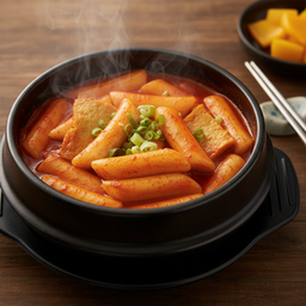
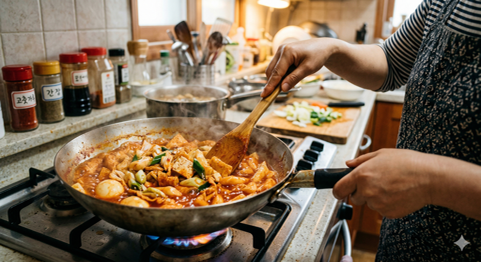

# 떡볶이

> *"불의 온도와 시간이 평범한 떡을 비범한 한 끼로 완성한다."*

1950년대 서울 종로의 작은 분식집에서 시작된 떡볶이는, 고추장이라는 단 하나의 양념으로 대한민국 길거리 음식의 역사를 다시 썼다. 쫄깃한 떡이 붉은 소스를 머금고 윤기를 띠는 그 순간, 소박한 재료는 중독성 있는 한 접시로 거듭난다. 누군가에게는 학창 시절의 추억이고, 누군가에게는 하루의 고단함을 달래주는 따뜻한 위로 — 그것이 떡볶이의 본질이다.

---

**조리 시간** 15분 · **서빙** 1인분 · **난이도** Easy

---

## Ingredients

| | |
|:------|:------|
| 떡볶이 떡 — 200g | 어묵 — 1장 (생략 가능) |
| 물 — 1컵 (200ml) | 고추장 — 1.5 큰술 |
| 간장 — 1 작은술 | 설탕 — 1 큰술 |
| 대파 — 약간 (생략 가능) | |

---

## Method

| Classic | Light |
|:------|:------|
| **01** 떡이 단단하면 찬물에 5분 담가 부드럽게 만듦. | **01** 떡 대신 곤약떡(150g) 사용. 찬물에 헹궈 잡내 제거. |
| **02** 어묵을 먹기 좋은 크기로 잘라 준비. | **02** 어묵 대신 두부 또는 삶은 달걀로 단백질 보강. |
| **03** 냄비에 물, 고추장, 간장, 설탕 넣고 고루 섞기. | **03** 설탕 → 알룰로스 대체. 고추장은 1큰술로 줄임. |
| **04** 중불에서 소스 끓어오르면 떡과 어묵 투입. | **04** 동일 진행. 양배추·팽이버섯 추가하면 포만감 UP. |
| **05** 중약불로 낮춰 7~8분간 저으며 졸이기. | **05** 곤약떡은 열전달 빠르므로 5분이면 충분. |
| **06** 소스 걸쭉해지고 떡 말랑해지면 완성. 대파 올려 마무리. | **06** 동일 마무리. 대파 올려 완성. |

---

## Chef's Note

| Classic Tips | Light Tips |
|:------|:------|
| 냄비 하나면 끝 — 원팟 조리로 설거지 최소화. | 곤약떡은 열량 거의 0에 가까움. 부담 없이 즐길 것. |
| 눌어붙지 않게 중간중간 저어줄 것. | 양배추·팽이버섯 추가하면 볼륨은 늘고 칼로리는 낮아짐. |
| 고추장 양으로 매운맛 조절 가능. | 알룰로스 없으면 스테비아 또는 설탕 1/2큰술로 대체. |
| 어묵 외 삶은 달걀·햄·두부 등으로 변주 가능. | 남은 소스에 곤약밥 비비면 저칼로리 마무리 완성. |
| 남은 소스에 밥 비비면 꿀맛. | |

---

> **Sommelier's Pairing** · 시원한 우유 한 잔 또는 달콤한 식혜 — 매운 소스의 여운을 부드럽게 마무리해준다.

---

*Recipe curated by Quick Cuisine Director — where simplicity meets elegance.*
